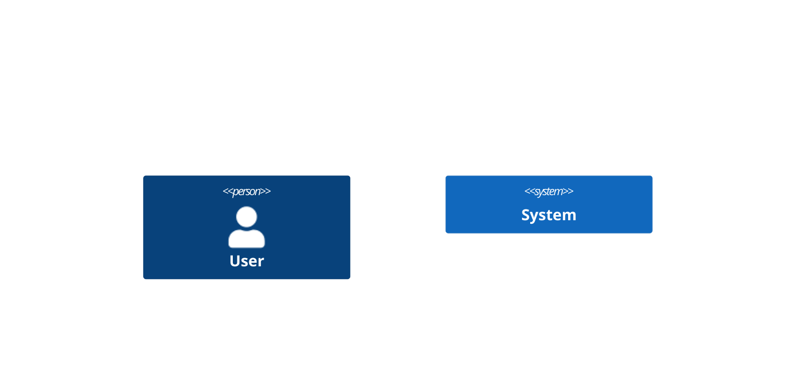
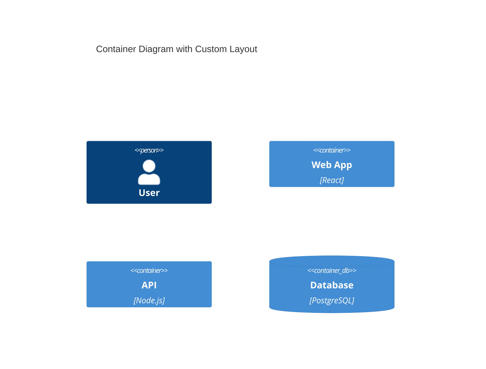
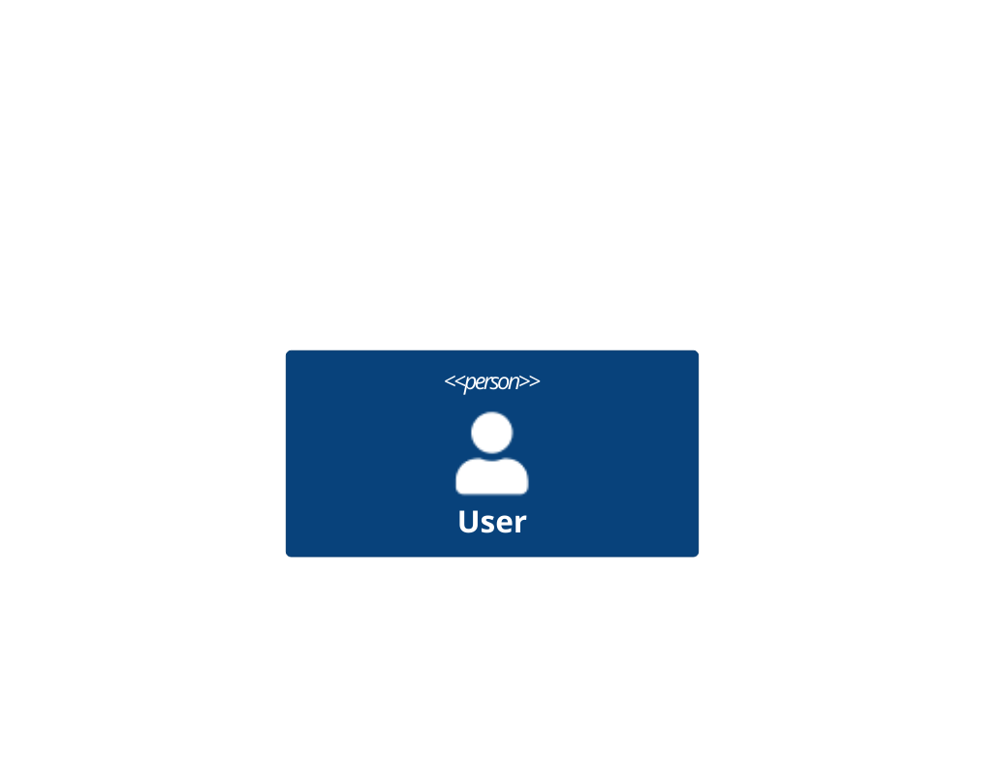
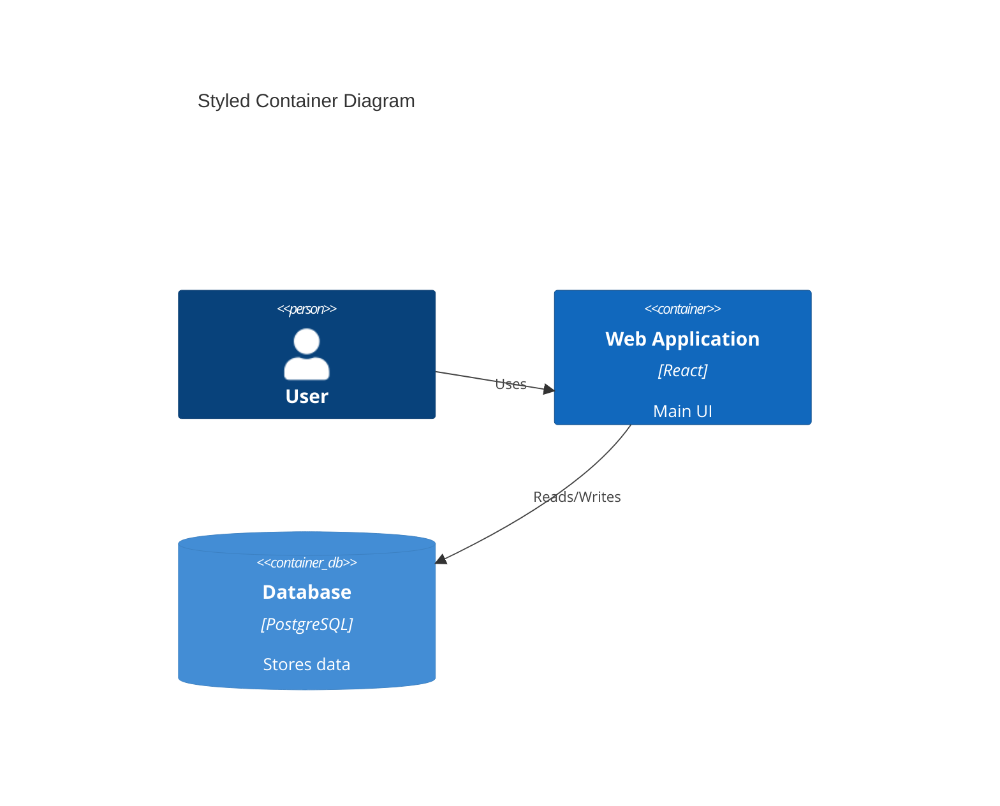
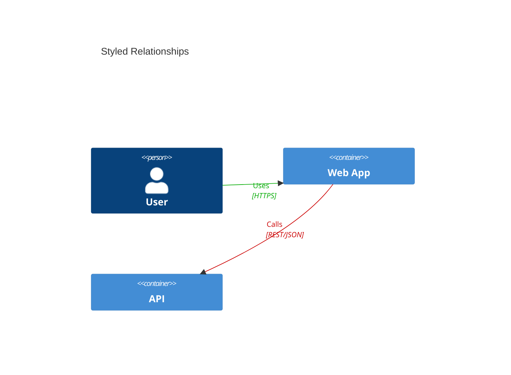
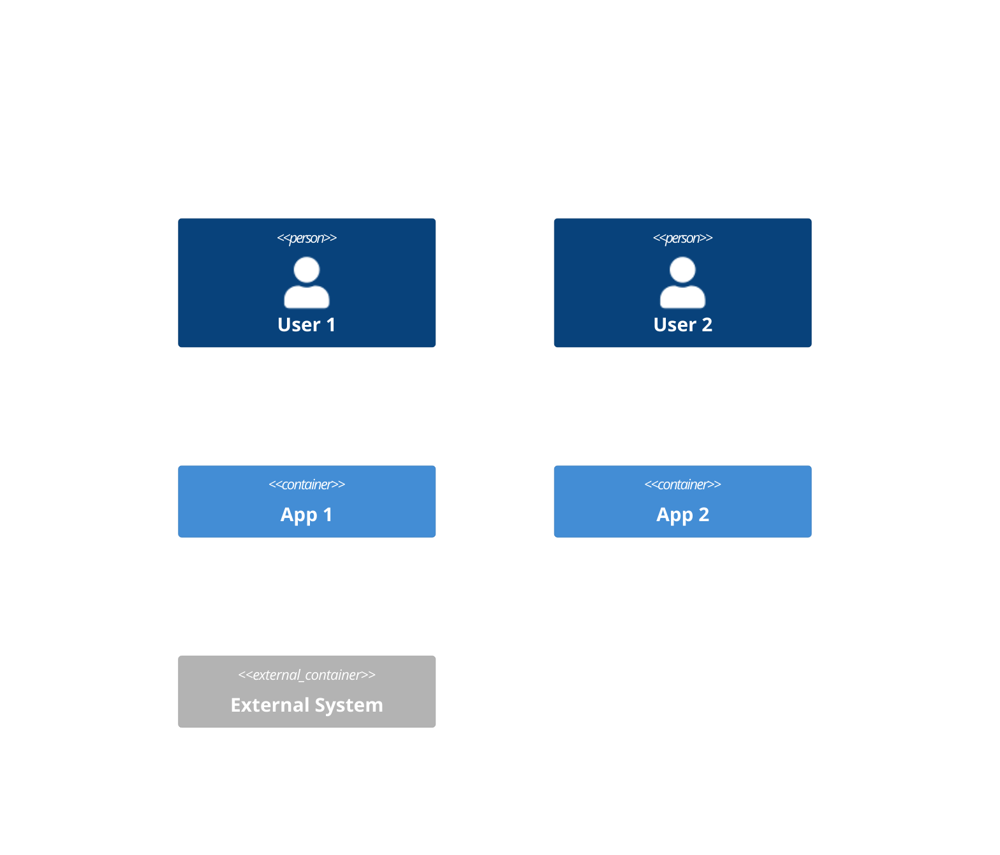
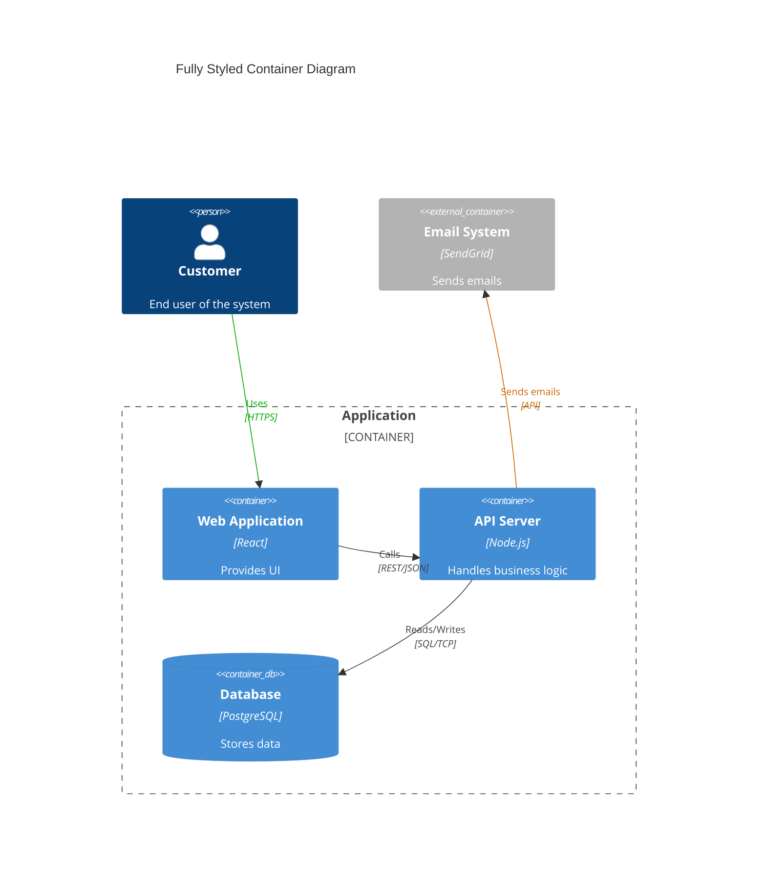

# C4 Diagram Styling Guide for Mermaid

## Overview

This guide covers how to customize and style C4 diagrams in Mermaid using `UpdateLayoutConfig` and other styling functions. These functions allow you to control colors, spacing, fonts, and other visual aspects of your C4 diagrams.

## UpdateLayoutConfig

The `UpdateLayoutConfig` directive allows you to customize the layout properties of your C4 diagram globally. This is placed after the diagram type declaration and before any diagram elements.

### Basic Syntax



### Common Layout Properties

| Property | Description | Default | Example Values |
|----------|-------------|---------|----------------|
| `$c4ShapeInRow` | Number of shapes per row | 4 | "2", "3", "4" |
| `$c4BoundaryInRow` | Number of boundaries per row | 2 | "1", "2", "3" |

### Example



## UpdateElementStyle

The `UpdateElementStyle` directive allows you to override the default styling for specific elements by their type or individual element.

> **Note**: Boundaries (Container_Boundary, System_Boundary, Enterprise_Boundary) **cannot be styled** using UpdateElementStyle. They use a fixed style in Mermaid's C4 implementation. Only diagram elements (Person, System, Container, Component, etc.) and relationships can be customized.

### Basic Syntax



### Styling Properties

| Property | Description | Example Values |
|----------|-------------|----------------|
| `$bgColor` | Background color | "blue", "#0066CC", "rgb(0,102,204)" |
| `$fontColor` | Text color | "white", "#FFFFFF" |
| `$borderColor` | Border color | "navy", "#003366" |
| `$shadowing` | Enable/disable shadow | "true", "false" |
| `$shape` | Shape type | "RoundedBoxShape", "EightSidedShape" |
| `$sprite` | Icon sprite | "person", "database" |
| `$legendText` | Custom legend text | "Custom Text" |
| `$legendSprite` | Legend icon | "server" |

### Example - Style Individual Elements



## UpdateRelStyle

The `UpdateRelStyle` directive allows you to customize the appearance of relationships between elements.

### Basic Syntax

```mermaid
C4Context
  Rel(user, system, "Uses")
  UpdateRelStyle(user, system, $textColor="blue", $lineColor="blue", $offsetX="-50", $offsetY="-20")
```

### Relationship Styling Properties

| Property | Description | Example Values |
|----------|-------------|----------------|
| `$textColor` | Relationship label color | "blue", "#0066CC" |
| `$lineColor` | Line color | "red", "#CC0000" |
| `$offsetX` | Horizontal label offset | "-50", "0", "50" |
| `$offsetY` | Vertical label offset | "-20", "0", "20" |

### Example



## Element Type Styling

You can apply styles to all elements of a specific type using the element type in UpdateElementStyle.

### Element Types

- `person` - All Person elements
- `external_person` - All Person_Ext elements
- `system` - All System elements
- `external_system` - All System_Ext elements
- `container` - All Container elements
- `external_container` - All Container_Ext elements
- `component` - All Component elements
- `external_component` - All Component_Ext elements

### Example - Style All Elements of a Type



## Complete Example



## Best Practices

1. **Consistency**: Use consistent colors for similar types of elements across diagrams
2. **Contrast**: Ensure sufficient contrast between background and text colors for readability
3. **Layout**: Adjust `$c4ShapeInRow` and `$c4BoundaryInRow` based on diagram complexity
4. **Relationship Clarity**: Use `UpdateRelStyle` with offset properties to prevent label overlap
5. **Color Coding**: Use colors to indicate different concerns (e.g., security boundaries, external vs internal)

## Color Palette Suggestions

### Default C4 Palette

- Person: `#08427B`
- Internal Container: `#1168BD`
- External Container: `#666666`
- Database: `#438DD5`

### Alternative Palettes

**Blue-Green Theme:**

- Person: `#0D5F89`
- Container: `#0F8B8D`
- Database: `#143642`

**Warm Theme:**

- Person: `#D64545`
- Container: `#E8871E`
- Database: `#DA4167`

## References

- [Mermaid C4 Documentation](https://mermaid.js.org/syntax/c4.html)
- [C4 Model](https://c4model.com/)
