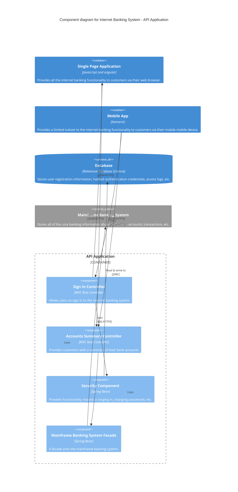

# Example of a C4 Component Diagram in Mermaid

## C4 Component Diagram definition

Next you can zoom in and decompose each container further to identify the major structural building blocks and their interactions.

The Component diagram shows how a container is made up of a number of "components", what each of those components are, their responsibilities and the technology/implementation details.

In a C4 component diagram, you're zooming into a specific container that was depicted in the Container diagram.
This diagram breaks down that container into its constituent components, showing the internal structure and how different parts of the container collaborate.
Each component represents a grouping of related functionality encapsulated behind a well-defined interface.

## What a C4 Component Diagram Would Depict

**The Container's Components**: These are the main structural building blocks within your container. Each component has a specific responsibility and represents a logical grouping of related functionality.
Examples include controllers, services, repositories, facades, business logic components, and data access components.

**External Containers**: Other containers from your system that the components interact with are shown as single blocks (similar to the Container level).
These represent databases, message queues, APIs, or other containers that your components communicate with.

**External Systems**: Any external systems that your components interact with directly are shown as single blocks.
These represent third-party services, legacy systems, or other organizational systems.

**Technology Details**: The Component diagram includes technology and implementation details for each component (e.g., "MVC Rest Controller", "Spring Bean", "Service Class").

**Communication Patterns**: The relationships between components show how they collaborate and which interfaces or methods they use to communicate.

## Mermaid C4 Components for Component Diagrams

### People and System Components

For People and External System components, refer to the definitions in [c4-systemcontext.def.md](c4-systemcontext.def.md).
These components work the same way in Component diagrams when you need to show external actors or systems.

### Container Components

For Container components that exist outside the component boundary being explored, refer to [c4-container.def.md](c4-container.def.md).
These are typically shown to provide context for where data flows from/to.

### Component Components

- `Component(id, "Name", "Technology", "Description")` - A component within your container that provides specific functionality
- `ComponentDb(id, "Name", "Technology", "Description")` - A database component within your container (though typically databases are containers)
- `ComponentQueue(id, "Name", "Technology", "Description")` - A queue component within your container for internal messaging

### Boundary Components

For basic boundary definitions, refer to [c4-systemcontext.def.md](c4-systemcontext.def.md).
Component diagrams typically use:

- `Container_Boundary(id, "Name")` - Groups components that belong to the same container

### Relationship Components

For relationship definitions, refer to [c4-systemcontext.def.md](c4-systemcontext.def.md) and [c4-container.def.md](c4-container.def.md).
Component diagrams support all relationship types including:

- `Rel(from, to, "Label")` - Unidirectional relationship with label
- `Rel(from, to, "Label", "Technology")` - Unidirectional relationship with label and technology
- `Rel_Back(from, to, "Label")` - Reverse direction relationship (useful for return flows)
- `Rel_Back(from, to, "Label", "Technology")` - Reverse direction relationship with technology specification

### Diagram Structure

- `C4Component` - Declares this as a C4 Component diagram
- `title "Diagram Title"` - Sets the diagram title

For styling and layout configuration options, refer to [c4-systemcontext.def.md](c4-systemcontext.def.md) and [c4-container.def.md](c4-container.def.md).

## C4 Component diagram Mermaid example

