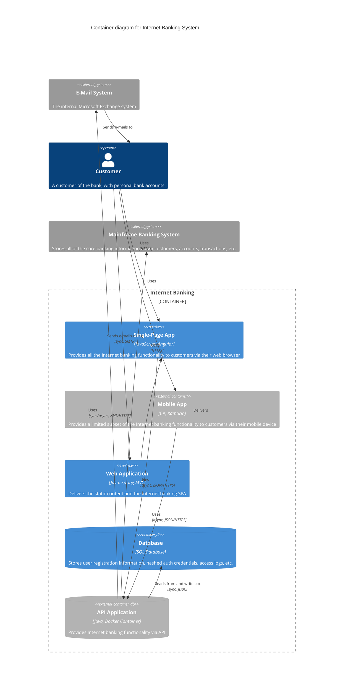

# Example of a C4 Container Diagram in Mermaid

## C4 Container Diagram definition

Once you understand how your system fits in to the overall IT environment, a really useful next step is to zoom-in to the system boundary with a Container diagram.
A “container” is something like a server-side web application, single-page application, desktop application, mobile app, database schema, file system, etc.
Essentially, a container is a separately runnable/deployable unit (e.g. a separate process space) that executes code or stores data.

The Container diagram shows the high-level shape of the software architecture and how responsibilities are distributed across it.
It also shows the major technology choices and how the containers communicate with one another.
It's a simple, high-level technology focussed diagram that is useful for software developers and support/operations staff alike.

## Mermaid C4 Components for Container Diagrams

### People Components
- `Person(id, "Name", "Description")` - Internal user/actor who interacts with containers
- `Person_Ext(id, "Name", "Description")` - External user/actor outside your organization

### System Components (External)
- `System_Ext(id, "Name", "Description")` - External system that your containers interact with
- `SystemDb_Ext(id, "Name", "Description")` - External database system
- `SystemQueue_Ext(id, "Name", "Description")` - External message queue system

### Container Components
- `Container(id, "Name", "Technology", "Description")` - A deployable unit within your system
- `Container_Ext(id, "Name", "Technology", "Description")` - External container outside your system boundary
- `ContainerDb(id, "Name", "Technology", "Description")` - Database container within your system
- `ContainerDb_Ext(id, "Name", "Technology", "Description")` - External database container
- `ContainerQueue(id, "Name", "Technology", "Description")` - Message queue container within your system
- `ContainerQueue_Ext(id, "Name", "Technology", "Description")` - External message queue container

### Boundary Components
- `Container_Boundary(id, "Name")` - Groups containers within your system boundary
- `Enterprise_Boundary(id, "Name")` - Groups elements within your enterprise/organization
- `System_Boundary(id, "Name")` - Groups related systems or containers together
- `Boundary(id, "Name", "Type")` - Generic boundary for grouping elements

### Relationship Components
- `Rel(from, to, "Label")` - Unidirectional relationship with label
- `Rel(from, to, "Label", "Technology")` - Unidirectional relationship with label and technology
- `Rel_Back(from, to, "Label")` - Reverse direction relationship
- `Rel_Back(from, to, "Label", "Technology")` - Reverse direction relationship with technology
- `BiRel(from, to, "Label")` - Bidirectional relationship with label

### Diagram Structure
- `C4Container` - Declares this as a C4 Container diagram
- `title "Diagram Title"` - Sets the diagram title

## C4 Container Diagram Mermaid example

