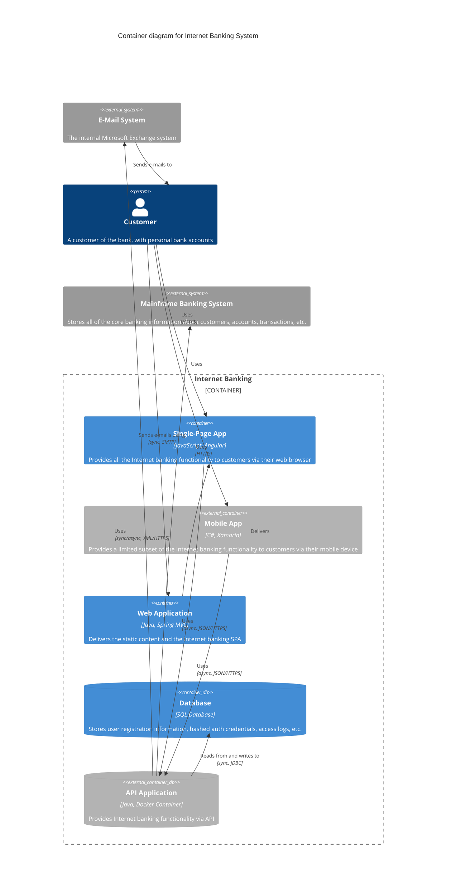

# Example of a C4 Container Diagram in Mermaid

## C4 Container Diagram definition

Once you understand how your system fits in to the overall IT environment, a really useful next step is to zoom-in to the system boundary with a Container diagram.
A "container" is something like a server-side web application, single-page application, desktop application, mobile app, database schema, file system, etc.
Essentially, a container is a separately runnable/deployable unit (e.g. a separate process space) that executes code or stores data.

The Container diagram shows the high-level shape of the software architecture and how responsibilities are distributed across it.
It also shows the major technology choices and how the containers communicate with one another.
It's a simple, high-level technology focussed diagram that is useful for software developers and support/operations staff alike.

In a C4 container diagram, you're zooming into the system that was depicted as a single block in the System Context diagram.
This diagram breaks down that system into its constituent containers, showing the internal structure and how different parts of the system work together.
Each container represents a separately deployable unit that has specific responsibilities and technologies.

## What a C4 Container Diagram Would Depict

**The System Containers**: These are the main deployable units within your system boundary. Each container has a specific responsibility and runs in its own process space.
Examples include web applications, APIs, databases, message queues, mobile apps, desktop applications, and microservices.

**External Systems**: Any external systems that your containers interact with are shown as single blocks (similar to the System Context level).
These represent third-party services, legacy systems, or other organizational systems that your containers communicate with.

**People/Actors**: The same users and actors from the System Context are shown, but now their interactions are specifically with individual containers rather than the system as a whole.

**Technology Details**: Unlike the System Context diagram, the Container diagram includes technology stack information for each container (e.g., "Java Spring Boot", "React SPA", "PostgreSQL Database").

**Communication Protocols**: The relationships between containers show not just what they communicate, but how they communicate (e.g., "HTTPS/REST", "TCP/IP", "Message Queue").

## Mermaid C4 Components for Container Diagrams

### People and System Components

For People and External System components, refer to the definitions in [c4-systemcontext.def.md](c4-systemcontext.def.md).
These components work the same way in Container diagrams, but now they interact with specific containers rather than the system as a whole.

### Container Components

- `Container(id, "Name", "Technology", "Description")` - A deployable unit within your system that executes code or provides functionality
- `Container_Ext(id, "Name", "Technology", "Description")` - External container outside your system boundary but relevant to show interactions
- `ContainerDb(id, "Name", "Technology", "Description")` - Database container within your system that stores and manages data
- `ContainerDb_Ext(id, "Name", "Technology", "Description")` - External database container that your system connects to for data operations
- `ContainerQueue(id, "Name", "Technology", "Description")` - Message queue container within your system for asynchronous communication
- `ContainerQueue_Ext(id, "Name", "Technology", "Description")` - External message queue container for integration with external systems

### Boundary Components

For basic boundary definitions, refer to [c4-systemcontext.def.md](c4-systemcontext.def.md).
Container diagrams introduce an additional boundary type:

- `Container_Boundary(id, "Name")` - Groups containers that belong to the same system or application boundary

### Boundary Nesting Use Cases

Container diagrams support various nesting permutations to represent different architectural scenarios:

#### Enterprise containing Systems containing Containers

```mmd
Enterprise_Boundary(enterprise, "Company") {
  System_Boundary(system1, "Core Banking System") {
    Container_Boundary(app1, "Internet Banking App") {
      Container(web, "Web App", "Java Spring")
      Container(api, "API", "Java Spring Boot")
    }
  }
  System_Boundary(system2, "External Services") {
    System_Ext(email, "Email System")
  }
}
```

Use when: Showing multiple systems within an enterprise, with one system broken down into containers.

#### System containing multiple Container Boundaries

```mmd
System_Boundary(ecommerce, "E-commerce Platform") {
  Container_Boundary(frontend, "Frontend Services") {
    Container(web, "Web Store", "React")
    Container(mobile, "Mobile App", "React Native")
  }
  Container_Boundary(backend, "Backend Services") {
    Container(api, "Product API", "Node.js")
    Container(payment, "Payment Service", "Java")
  }
}
```

Use when: Breaking down a single system into logical service groups.

#### Generic Boundary for deployment environments

```mmd
Boundary(prod, "Production Environment", "AWS") {
  Container_Boundary(app, "Application") {
    Container(web, "Web App", "Docker")
    ContainerDb(db, "Database", "PostgreSQL")
  }
}
```

Use when: Showing deployment or infrastructure boundaries around containers.

#### Mixed nesting for complex architectures

```mmd
Enterprise_Boundary(org, "Organization") {
  Boundary(cloud, "Cloud Environment", "AWS") {
    System_Boundary(microservices, "Microservices Platform") {
      Container(service1, "User Service", "Java")
      Container(service2, "Order Service", "Python")
    }
  }
  System_Ext(legacy, "Legacy System")
}
```

Use when: Representing complex multi-layered architectures with cloud deployment and legacy integration.

### Relationship Components

For relationship definitions, refer to [c4-systemcontext.def.md](c4-systemcontext.def.md).
Container diagrams additionally support:

- `Rel_Back(from, to, "Label")` - Reverse direction relationship (useful for return flows)
- `Rel_Back(from, to, "Label", "Technology")` - Reverse direction relationship with technology specification

### Diagram Structure

- `C4Container` - Declares this as a C4 Container diagram
- `title "Diagram Title"` - Sets the diagram title

For styling and layout configuration options, refer to [c4-systemcontext.def.md](c4-systemcontext.def.md).

## C4 Container Diagram Mermaid example


